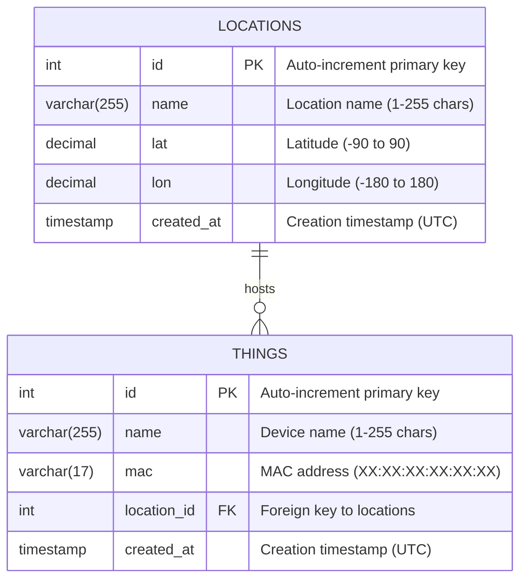

# FastAPI IoT CMDB - Architecture Review & Database Schema

## Overview
FastAPI IoT Configuration Management Database (CMDB) for tracking and managing IoT devices and their physical locations.

## Technology Stack
- **Framework**: FastAPI (Python web framework)
- **ORM**: SQLModel (unified SQLAlchemy + Pydantic approach)
- **Database**: PostgreSQL (configurable via environment)
- **Validation**: Pydantic v2 with field validators
- **API Documentation**: OpenAPI/Swagger automatic generation

## Current Architecture

### 1. Application Structure
```
app/
├── main.py              # FastAPI application setup, CORS, lifespan
├── database.py          # Database connection & session management
├── config.py            # Environment configuration
├── models.py            # SQLModel data models (unified approach)
└── routers/
    ├── locations.py     # Location CRUD endpoints
    └── things.py        # Thing CRUD endpoints
```

### 2. Data Models Architecture

#### Model Hierarchy
```
SQLModel Base Classes:
├── LocationBase
│   ├── Location (table=True)
│   ├── LocationCreate
│   ├── LocationUpdate
│   ├── LocationRead
│   └── LocationReadWithThings
└── ThingBase
    ├── Thing (table=True)
    ├── ThingCreate
    ├── ThingUpdate
    ├── ThingRead
    └── ThingReadWithLocation
```

## Database Schema

### Entity Relationship Diagram



### Table Specifications

#### `locations` Table
| Column | Type | Constraints | Description |
|--------|------|-------------|-------------|
| `id` | INTEGER | PRIMARY KEY, AUTO_INCREMENT | Unique location identifier |
| `name` | VARCHAR(255) | NOT NULL, LENGTH(1-255) | Location name/description |
| `lat` | DECIMAL | NOT NULL, DEFAULT 0.0, RANGE(-90,90) | Latitude coordinate |
| `lon` | DECIMAL | NOT NULL, DEFAULT 0.0, RANGE(-180,180) | Longitude coordinate |
| `created_at` | TIMESTAMP | NOT NULL, DEFAULT UTC_NOW | Record creation time |

#### `things` Table
| Column | Type | Constraints | Description |
|--------|------|-------------|-------------|
| `id` | INTEGER | PRIMARY KEY, AUTO_INCREMENT | Unique thing identifier |
| `name` | VARCHAR(255) | NOT NULL, LENGTH(1-255) | Device/thing name |
| `mac` | VARCHAR(17) | NOT NULL, REGEX_VALIDATED | MAC address in XX:XX:XX:XX:XX:XX format |
| `location_id` | INTEGER | NOT NULL, FOREIGN KEY → locations.id | Associated location |
| `created_at` | TIMESTAMP | NOT NULL, DEFAULT UTC_NOW | Record creation time |

### Relationships
- **One-to-Many**: `locations` → `things`
  - One location can host multiple IoT devices
  - Each thing must belong to exactly one location
  - Foreign key constraint ensures referential integrity

### Validation Rules

#### Location Validation
- **Name**: 1-255 characters, required
- **Latitude**: -90.0 to 90.0 degrees
- **Longitude**: -180.0 to 180.0 degrees
- **Coordinates**: Default to (0.0, 0.0) if not specified

#### Thing Validation
- **Name**: 1-255 characters, required
- **MAC Address**: Strict regex validation `^([0-9A-Fa-f]{2}[:-]){5}([0-9A-Fa-f]{2})$`
- **Location ID**: Must reference existing location

## API Endpoints

### Location Endpoints (`/locations`)
| Method | Endpoint | Description | Response Model |
|--------|----------|-------------|----------------|
| GET | `/locations` | List all locations | `List[LocationRead]` |
| GET | `/locations/{id}` | Get location by ID | `LocationRead` |
| POST | `/locations` | Create new location | `LocationRead` |
| PUT | `/locations/{id}` | Update location | `LocationRead` |
| DELETE | `/locations/{id}` | Delete location | `204 No Content` |

### Thing Endpoints (`/things`)
| Method | Endpoint | Description | Response Model |
|--------|----------|-------------|----------------|
| GET | `/things` | List all things with locations | `List[ThingReadWithLocation]` |
| GET | `/things/{id}` | Get thing by ID with location | `ThingReadWithLocation` |
| POST | `/things` | Create new thing | `ThingRead` |
| PUT | `/things/{id}` | Update thing | `ThingRead` |
| DELETE | `/things/{id}` | Delete thing | `204 No Content` |

## Key Architecture Features

### 1. SQLModel Unified Approach
- **Single source of truth**: Models serve both as database tables and API schemas
- **Type safety**: Full type checking from database to API responses
- **Reduced duplication**: Eliminates separate SQLAlchemy and Pydantic model files

### 2. Relationship Management
- **Bidirectional relationships**: `Location.things` ↔ `Thing.location`
- **Lazy loading**: Relationships loaded on demand
- **Cascade behavior**: Configurable via SQLModel relationships

### 3. Validation Strategy
- **Field-level validation**: Pydantic validators for data integrity
- **Database constraints**: Foreign keys ensure referential integrity
- **API-level validation**: FastAPI automatic request/response validation

### 4. Application Lifecycle
- **Lifespan management**: Database tables created on startup
- **Session handling**: Context manager pattern for database sessions
- **Connection pooling**: Optimized database connection management

## Security Considerations
- **Input validation**: All inputs validated against strict schemas
- **SQL injection protection**: SQLModel/SQLAlchemy ORM prevents SQL injection
- **CORS configuration**: Configurable origins for cross-origin requests
- **No sensitive data exposure**: Models exclude internal fields in responses

## Scalability Considerations
- **Connection pooling**: Configured for production workloads
- **Index opportunities**: Primary keys and foreign keys automatically indexed
- **Query optimization**: Relationship loading can be optimized with eager loading
- **Horizontal scaling**: Stateless API design supports load balancing

## Testing Coverage
- **Full CRUD testing**: All endpoints tested with comprehensive test suite
- **Relationship testing**: Foreign key relationships validated
- **Data validation testing**: MAC address format and coordinate bounds tested
- **End-to-end testing**: Complete workflows from creation to retrieval tested

## Future Enhancement Opportunities
1. **Indexing**: Add composite indexes for common query patterns
2. **Caching**: Implement Redis caching for frequently accessed data
3. **Audit logging**: Track changes with audit trail
4. **Soft deletes**: Implement logical deletes instead of physical deletes
5. **Bulk operations**: Add endpoints for bulk create/update/delete
6. **Filtering/Pagination**: Add query parameters for list endpoints
7. **Device metadata**: Extend things model with additional IoT device properties
