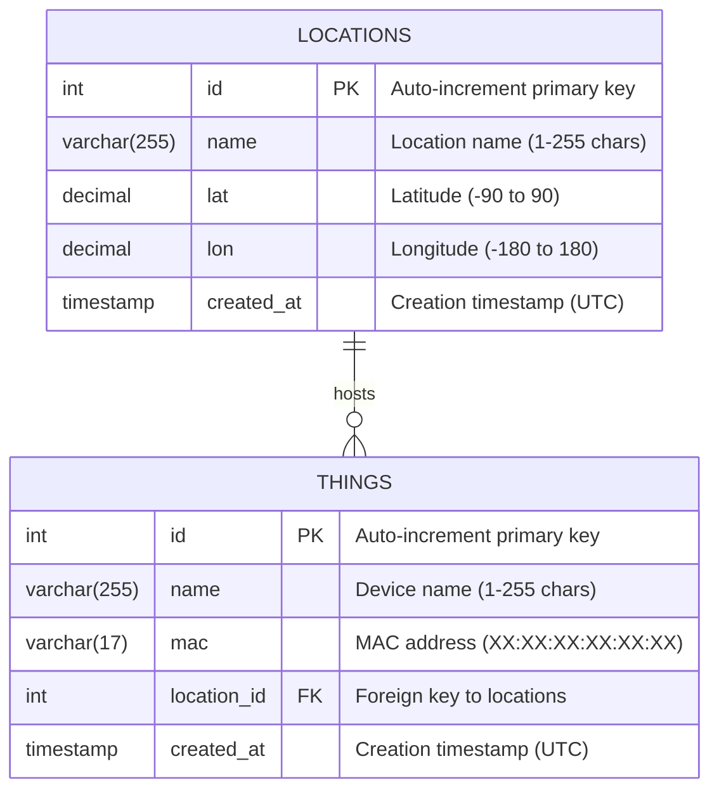
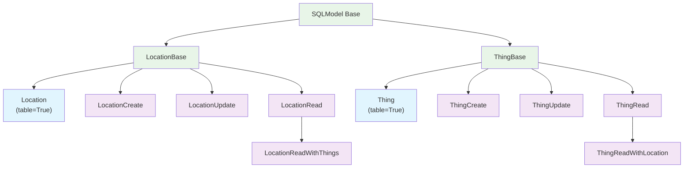

# Database Schema Diagram

## Entity Relationship Diagram

## Database Tables

### Locations Table
| Column | Type | Constraints | Description |
|--------|------|-------------|-------------|
| `id` | INTEGER | PRIMARY KEY, AUTO_INCREMENT | Unique location identifier |
| `name` | VARCHAR(255) | NOT NULL, LENGTH(1-255) | Location name/description |
| `lat` | DECIMAL | NOT NULL, DEFAULT 0.0, RANGE(-90,90) | Latitude coordinate |
| `lon` | DECIMAL | NOT NULL, DEFAULT 0.0, RANGE(-180,180) | Longitude coordinate |
| `created_at` | TIMESTAMP | NOT NULL, DEFAULT UTC_NOW | Record creation time |

### Things Table
| Column | Type | Constraints | Description |
|--------|------|-------------|-------------|
| `id` | INTEGER | PRIMARY KEY, AUTO_INCREMENT | Unique thing identifier |
| `name` | VARCHAR(255) | NOT NULL, LENGTH(1-255) | Device/thing name |
| `mac` | VARCHAR(17) | NOT NULL, REGEX_VALIDATED | MAC address in XX:XX:XX:XX:XX:XX format |
| `location_id` | INTEGER | NOT NULL, FOREIGN KEY → locations.id | Associated location |
| `created_at` | TIMESTAMP | NOT NULL, DEFAULT UTC_NOW | Record creation time |

## Example Data

### Locations
| id | name | lat | lon | created_at |
|----|------|-----|-----|------------|
| 1 | Main Office | 37.7749 | -122.4194 | 2024-01-15 10:30:00 |
| 2 | Warehouse A | 40.7128 | -74.0060 | 2024-01-16 14:15:30 |
| 3 | Data Center | 51.5074 | -0.1278 | 2024-01-17 09:45:22 |

### Things
| id | name | mac | location_id | created_at |
|----|------|-----|-------------|------------|
| 1 | Sensor-001 | AA:BB:CC:DD:EE:FF | 1 | 2024-01-15 11:00:00 |
| 2 | Camera-Main | 11:22:33:44:55:66 | 1 | 2024-01-15 11:30:00 |
| 3 | Temp-Monitor | FF:EE:DD:CC:BB:AA | 2 | 2024-01-16 15:00:00 |
| 4 | UPS-Device | 12:34:56:78:9A:BC | 3 | 2024-01-17 10:00:00 |

## SQLModel Class Hierarchy

## Validation Rules

### Location Validation
- **name**: 1-255 characters, required
- **lat**: -90.0 ≤ latitude ≤ 90.0, default 0.0
- **lon**: -180.0 ≤ longitude ≤ 180.0, default 0.0
- **created_at**: Auto-generated UTC timestamp

### Thing Validation
- **name**: 1-255 characters, required
- **mac**: Regex pattern `^([0-9A-Fa-f]{2}[:-]){5}([0-9A-Fa-f]{2})$`
- **location_id**: Must reference existing location.id
- **created_at**: Auto-generated UTC timestamp

### Relationship Rules
- **Foreign key constraint**: things.location_id → locations.id
- **Cascade behavior**: Configurable via SQLModel relationships
- **Bidirectional**: Location.things ↔ Thing.location

## API Endpoints

### Location Endpoints (`/locations`)
| Method | Endpoint | Description | Response Model |
|--------|----------|-------------|----------------|
| GET | `/locations` | List all locations | `List[LocationRead]` |
| GET | `/locations/{id}` | Get location by ID | `LocationRead` |
| POST | `/locations` | Create new location | `LocationRead` |
| PUT | `/locations/{id}` | Update location | `LocationRead` |
| DELETE | `/locations/{id}` | Delete location | `204 No Content` |

### Thing Endpoints (`/things`)
| Method | Endpoint | Description | Response Model |
|--------|----------|-------------|----------------|
| GET | `/things` | List all things with locations | `List[ThingReadWithLocation]` |
| GET | `/things/{id}` | Get thing by ID with location | `ThingReadWithLocation` |
| POST | `/things` | Create new thing | `ThingRead` |
| PUT | `/things/{id}` | Update thing | `ThingRead` |
| DELETE | `/things/{id}` | Delete thing | `204 No Content` |

### Relationships in API Responses
- **GET /things/***: Includes location data via JOIN
- **GET /locations/***: Can optionally include things
