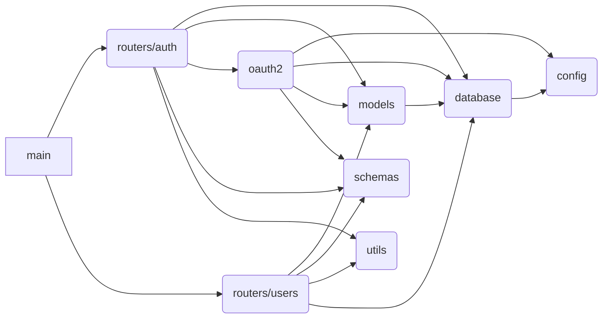

# FastAPI IoT CMDB

## Details

### Local Setup

<https://github.com/dessyd/fastapi-iot-cmdb/blob/7afa3ced8e9d8d89754d945572939c415c53250d/setup.sh#L1-L17>

### Run the Environment

```bash
# start database engine
docker compose up -d
# Initialize alembic file structure
alembic init alembic
# copy the project ini file
cp app/alembic.env.py alembic/env.py
# Autogenerate the database schema creation file
alembic revision --autogenerate -m "Application schema"
# Execute the schema creation
alembic upgrade head
# Start Web server:
uvicorn app.main:app --reload
```

## Modules dependencies


