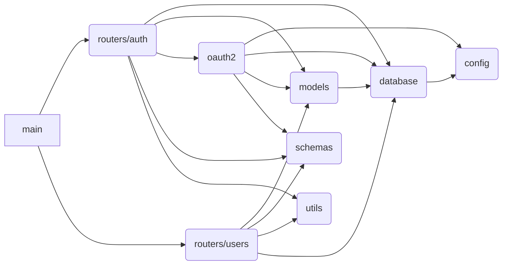

# FastAPI IoT CMDB

## Details

https://github.com/dessyd/fastapi-iot-cmdb/blob/8bbc65c39444d01ab2a76daaf44e976fb4685111/setup.sh

### Local Setup

```bash
# Install Postgres
brew install postgresql
# Create virtual environment
python3 -m venv .venv
# Activate it
source .venv/bin/activate
# make sure pip is up to date
pip install --upgrade pip
# install project's requirements
pip install -r requirements.txt
# Install pre-commit
pre-commit install
# Auto update to latest hooks
pre-commit autoupdate
# Have a first test
pre-commit run --all-files
# start database engine
docker compose up -d
# Initialize alembic file structure
alembic init alembic
# copy the project ini file
# Autogenerate the database schema creation file
alembic revision --autogenerate -m "Application schema"
# Execute the schema creation
alembic upgrade head
# Start Web server:
uvicorn app.main:app --reload
```

## Modules dependencies


