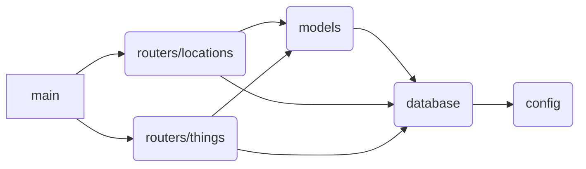

# FastAPI IoT CMDB

A Configuration Management Database (CMDB) for tracking and managing IoT devices and their physical locations.

## Features

- **Location Management**: Track physical locations with GPS coordinates
- **Device Tracking**: Manage IoT devices with MAC addresses and location associations
- **RESTful API**: Complete CRUD operations for locations and things
- **SQLModel Integration**: Unified data models serving both database and API schemas
- **Comprehensive Testing**: Full test suite with 9 test cases covering all operations

## Quick Start

### Prerequisites

- Python 3.8+
- PostgreSQL database
- Virtual environment (recommended)

### Installation

1. **Clone and setup environment**:

   ```bash
   git clone <repository-url>
   cd fastapi-iot-cmdb
   python -m venv .venv
   source .venv/bin/activate  # On Windows: .venv\Scripts\activate
   pip install -r requirements.txt
   ```

2. **Configure environment**:

   Copy `.env.example` to `.env` and configure your database settings:

   ```bash
   DATABASE_DRIVER=postgresql
   DATABASE_HOSTNAME=localhost
   DATABASE_PORT=5432
   DATABASE_NAME=iot_cmdb
   DATABASE_USERNAME=your_username
   DATABASE_PASSWORD=your_password
   ```

3. **Start the application**:

   ```bash
   # Database tables are created automatically on startup
   python -m uvicorn app.main:app --reload
   ```

4. **Run tests** (optional):

   ```bash
   python test_api.py
   ```

### Using Docker Compose

```bash
# Start database engine
docker compose up -d

# Start web server
uvicorn app.main:app --reload
```

## API Documentation

Once running, access the interactive API documentation at:

- **Swagger UI**: <http://localhost:8000/docs>
- **ReDoc**: <http://localhost:8000/redoc>

## Architecture

### Current Module Dependencies


```mermaid
flowchart LR
    c(config)
    d(database)
    m(models)
    rl(routers/locations)
    rt(routers/things)

    d --> c
    m --> d

    main --> rl
    main --> rt

    rl --> d
    rl --> m

    rt --> d
    rt --> m
```

### Key Components

- **`app/main.py`**: FastAPI application setup with CORS and lifespan management
- **`app/models.py`**: SQLModel unified data models (database + API schemas)
- **`app/database.py`**: Database connection and session management
- **`app/routers/`**: API endpoint implementations

## Documentation

- **[Architecture Review](ARCHITECTURE_REVIEW.md)**: High-level system design and patterns
- **[Database Schema](DATABASE_SCHEMA.md)**: Detailed technical implementation
- **[Test Suite](test_api.py)**: Comprehensive API testing

## Database Schema

The system manages two main entities:

- **Locations**: Physical sites with GPS coordinates
- **Things**: IoT devices with MAC addresses linked to locations

See [DATABASE_SCHEMA.md](DATABASE_SCHEMA.md) for detailed schema information.

## Contributing

1. Fork the repository
2. Create a feature branch
3. Make your changes
4. Run tests: `python test_api.py`
5. Submit a pull request

## License

This project is licensed under the MIT License.
