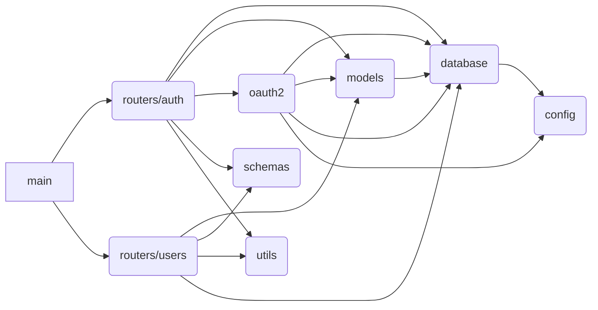

# FastAPI IoT CMDB

## Details

### Local Setup

```bash
# Install Postgres
brew install postgresql
# Create virtual environment
python3 -m venv venv
# Activate it
source venv/bin/activate
# make sure pip is up to date
pip install --upgrade pip
# install project's requirements
pip install -r requirements.txt
# start database engine
docker compose up -d
# Initialize alembic file structure
alembic init alembic
# copy the project ini file
cp app/alembic.env.py alembic/env.py
# Autogenerate the database schema creation file
alembic revision --autogenerate -m "Application schema"
# Execute the schema creation
alembic upgrade head
# Start Web server:
uvicorn app.main:app --reload
```

## Modules dependencies


